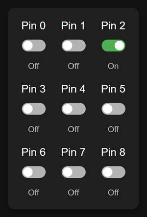

# esp8266-web-pin-control
Control digital pins of ESP8266 over web with micropython



# Usage Notes
Small project to use an old RobotDyn WiFi D1 R2 ESP8266 module as a simple web server that allows you to control the GPIO pins. The code is written in Micropython and uses the flask-like framework provided by microdot.

https://github.com/miguelgrinberg/microdot

The dev board I had didn't have enough ram to run microdot direction, so I added the module to the micropython manifest and re-built the target firmware, process described below.

# Build Instructions

**Update your wifi ssid, key, and network details in boot.py.**

These instructions are for builds on windows using ps7 and docker. You will need to have Docker installed and running.

Get the esp8266-micropython source code from here

```
git clone --branch v1.23.0 https://github.com/micropython/micropython.git
```

Fetch the microdot library and place it in the esp8266 port source tree.

```
curl -O --output-dir micropython/ports/esp8266/boards https://raw.githubusercontent.com/miguelgrinberg/microdot/v2.0.6/src/microdot/microdot.py
```

Append microdot to the manifest for the esp8266, this is windows/ps7.

```
Add-Content micropython/ports/esp8266/boards/manifest.py 'module("microdot.py")'
```

Build the firmware using docker.  These commands are for windows/docker/ps7  See more detailed instructions here:
https://github.com/micropython/micropython/tree/v1.23.0/ports/esp8266

```
docker run --rm -v ${PWD}:/mnt -w /mnt/micropython larsks/esp-open-sdk make -C ports/esp8266 submodules
```
```
docker run --rm -v ${PWD}:/mnt -w /mnt/micropython larsks/esp-open-sdk make -C mpy-cross
```
```
docker run --rm -v ${PWD}:/mnt -w /mnt/micropython larsks/esp-open-sdk make -C ports/esp8266 -j BOARD=ESP8266_GENERIC
```

The firmware will be built as micropython/ports/esp8266/build-ESP8266_GENERIC/firmware.bin.  You can upload it to your esp8266 using esptool.py.  Update COMX for your COM port.

More details here: https://docs.micropython.org/en/v1.23.0/esp8266/tutorial/intro.html

```
esptool --port COMX erase_flash
```

```
esptool --port COMX --baud 460800 write_flash --flash_size=detect --verify 0 micropython/ports/esp8266/build-ESP8266_GENERIC/firmware.bin
```

Copy the files to the target, remember to update the wifi ssid, key, and network details in boot.py.

More details here: https://docs.micropython.org/en/latest/reference/mpremote.html

```
mpremote cp boot.py :
mpremote cp main.py :
mpremote cp index.html :
```

You can then reset the board and direct your browser to http://esp_ip/ .